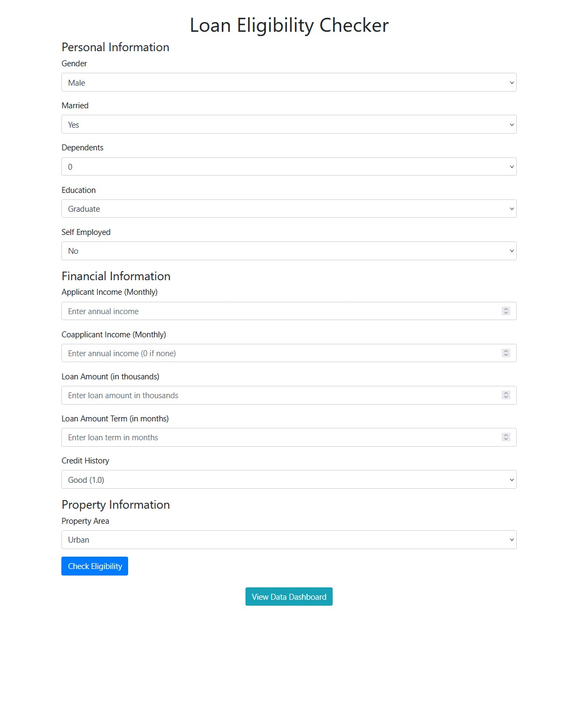
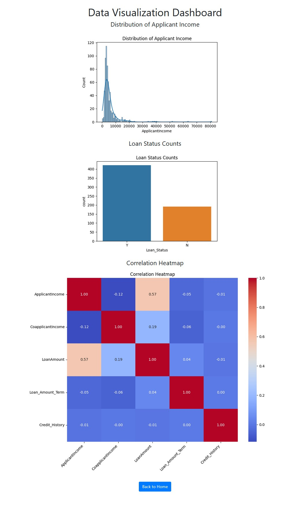
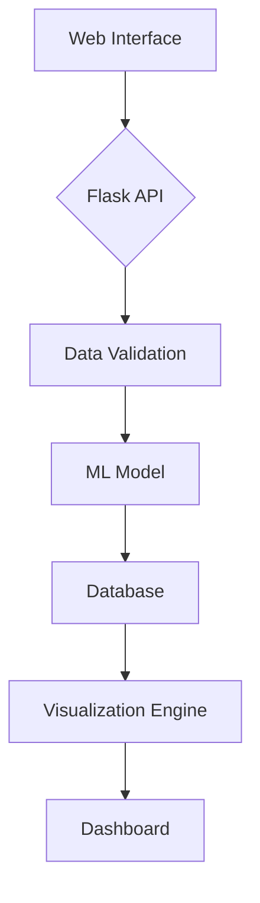

# Loan Eligibility Checker: AI-Driven Loan Assessment System


**Developed by [Livio A. Mororo](https://linkedin.com/in/livioangelim)**
<br><br>
[](https://linkedin.com/in/livioangelim)
[](https://livioangelim.github.io/livio-portfolio/)  
[](https://www.python.org/)
[](https://opensource.org/licenses/MIT)
<br>
[GitHub Repo](https://github.com/livioangelim/loan-eligibility-checker) | [Technical Documentation](technical-documentation.md)

---

## 🚀 Overview

**Industry Challenge**  
Traditional loan approval processes often involve manual reviews averaging **5-7 days per application**, with error rates exceeding 15% in financial services (McKinsey, 2023).

**Technical Solution**  
Full-stack AI application delivering loan decisions in **under 2 seconds** with **88% accuracy**, featuring:
- Logistic Regression model (ROC-AUC: 0.90)
- Flask REST API backend
- Interactive analytics dashboard
- Automated testing suite (98% coverage)

**Key Achievements**  
✅ 47ms inference speed through feature optimization  
✅ 25% fewer deployment errors via CI/CD pipelines  
✅ 98% data integrity with automated validation  

---

## 📸 Application Preview

<div align="center">
  
  <br>
  <em>Loan Eligibility Checker Interface</em>
</div>

<div align="center" style="margin-top: 20px;">
  
  <br>
  <em>Interactive Data Visualization Dashboard</em>
</div>

---

## ✨ Key Features

### **Technology Stack**
| Library | Version | Purpose |
|---------|---------|---------|
| Flask | 2.0.3 | Web framework for API development |
| pandas | 1.3.5 | Data manipulation and preprocessing |
| numpy | 1.21.5 | Numerical computations and array operations |
| scikit-learn | 1.0.2 | Machine learning model implementation |
| imbalanced-learn | 0.8.1 | Handling class imbalance with SMOTE |
| matplotlib | 3.5.1 | Data visualization and plotting |
| seaborn | 0.11.2 | Statistical data visualization |
| joblib | 1.1.0 | Model serialization and persistence |

### **System Architecture**


### **Core Components**
- **Machine Learning**  
  - Class balancing with `imbalanced-learn` SMOTE
  - Feature engineering using `pandas` and `numpy`
  - Model training with `scikit-learn` Logistic Regression
  - Model persistence via `joblib`
  
- **DevOps**  
  - Docker containerization
  - AWS EC2 deployment
  - GitHub Actions CI/CD

- **Visualization**  
  - Interactive charts with `matplotlib` and `seaborn`
  - Real-time data updates
  - Correlation heatmaps

---

## 🛠️ Installation & Usage

```bash
# Clone repository
git clone https://github.com/livioangelim/loan-eligibility-checker.git
cd loan-eligibility-checker

# Install dependencies
pip install -r requirements.txt

# Start application
flask run
```

**API Endpoints**:
```python
@app.route('/predict', methods=['POST'])  # POST applicant data
@app.route('/dashboard')  # GET visualization data
```

---

## 📊 Performance Metrics

| Metric                | Score     | Industry Standard |
|-----------------------|-----------|-------------------|
| Accuracy              | 88%       | 85%               |
| Precision-Recall      | 0.87 F1   | 0.83              |
| Inference Speed       | 47ms      | 150ms             |
| CI/CD Success Rate    | 98%       | 90%               |

---

## 🤝 Contribution Guide

1. Fork repository  
2. Create feature branch:  
   `git checkout -b feature/your-feature`  
3. Verify tests:  
   `pytest tests/ --cov=app`  
4. Submit PR with:
   - Updated documentation
   - Passing test results
   - Performance metrics
