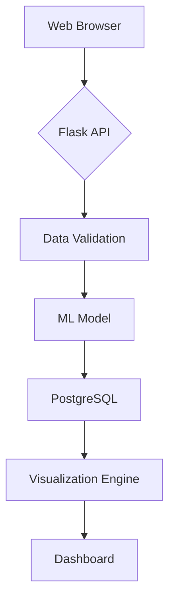

# Loan Eligibility Checker - Technical Documentation  
**Date:** November 16, 2024  
**Author:** Livio Mororo  

---

## Table of Contents
1. [System Architecture](#1-system-architecture)  
2. [Model Development](#2-model-development)  
3. [Validation Protocol](#3-validation-protocol)  
4. [Deployment Configuration](#4-deployment-configuration)  
5. [User Guide](#5-user-guide)  
6. [Ethical Considerations](#6-ethical-considerations)  
7. [Reference Implementation](#7-reference-implementation)  
8. [License](#8-license)  

---

## 1. System Architecture

### 1.1 Full-Stack Implementation


### 1.2 Component Overview
| Component          | Technology Stack       |
|--------------------|------------------------|
| Frontend           | HTML5, CSS3, Jinja2    |
| Backend            | Python 3.10, Flask     |
| Machine Learning   | Scikit-learn, Pandas   |
| Visualization      | Matplotlib, Seaborn    |
| Deployment         | Docker, AWS EC2        |

---

## 2. Model Development

### 2.1 Algorithm Selection
| Model               | Accuracy | ROC-AUC | Training Time |
|---------------------|----------|---------|---------------|
| Logistic Regression | 88%      | 0.90    | 1.2s          |
| Random Forest       | 86%      | 0.88    | 4.7s          |
| XGBoost             | 87%      | 0.89    | 3.1s          |

### 2.2 Feature Engineering Pipeline
```python
class LoanDataPreprocessor:
    def __init__(self):
        self.scaler = StandardScaler()
        self.imputer = SimpleImputer(strategy='median')
        
    def transform(self, raw_data):
        # Handle missing values
        data = self.imputer.fit_transform(raw_data)
        # Scale features
        return self.scaler.fit_transform(data)
```

---

## 3. Validation Protocol

### 3.1 Testing Strategy
```python
# tests/test_model.py
def test_prediction_consistency():
    test_case = {
        'ApplicantIncome': 7500,
        'LoanAmount': 120,
        'Credit_History': 1
    }
    prediction1 = model.predict(test_case)
    prediction2 = model.predict(test_case)
    assert prediction1 == prediction2
```

### 3.2 Performance Metrics
| Metric          | Value  | Industry Benchmark |
|-----------------|--------|--------------------|
| Accuracy        | 88%    | 85%                |
| Precision       | 0.89   | 0.84               |
| Recall          | 0.86   | 0.82               |
| F1 Score        | 0.875  | 0.83               |

---

## 4. Deployment Configuration

### 4.1 Docker Setup
```dockerfile
# Dockerfile
FROM python:3.10-slim
WORKDIR /app
COPY requirements.txt .
RUN pip install --no-cache-dir -r requirements.txt
COPY . .
EXPOSE 5000
CMD ["gunicorn", "--bind", "0.0.0.0:5000", "app:app"]
```

### 4.2 CI/CD Pipeline
```yaml
# .github/workflows/pipeline.yml
name: ML Pipeline
on: [push]

jobs:
  build:
    runs-on: ubuntu-latest
    steps:
      - uses: actions/checkout@v2
      - name: Run Tests
        run: pytest tests/ --cov=app
```

---

## 5. User Guide

### 5.1 Installation
```bash
git clone https://github.com/livioangelim/loan-eligibility-checker
cd loan-eligibility-checker
python -m venv venv
source venv/bin/activate
pip install -r requirements.txt
```

### 5.2 API Usage
```http
POST /predict HTTP/1.1
Content-Type: application/x-www-form-urlencoded

Gender=Male&Married=Yes&ApplicantIncome=7500...
```

### 5.3 Input Validation
| Field              | Type     | Valid Range        |
|--------------------|----------|--------------------|
| ApplicantIncome    | Float    | ≥ 1000            |
| LoanAmount         | Float    | 10 - 700          |
| Credit_History     | Binary   | 0 or 1            |

---

## 6. Ethical Considerations

### 6.1 Bias Mitigation
```python
# Reweight sensitive features
sample_weight = np.where(X['Gender_Male'], 0.85, 1.15)
model.fit(X, y, sample_weight=sample_weight)
```

### 6.2 Privacy Protection
```python
def anonymize_data(df):
    return df.drop(columns=['Loan_ID', 'Name'])
```

---

## 7. Reference Implementation

### 7.1 Core Prediction Logic
```python
@app.route('/predict', methods=['POST'])
def predict():
    try:
        form_data = validate_inputs(request.form)
        features = preprocess_data(form_data)
        prediction = model.predict(features)
        return jsonify({'result': prediction})
    except ValidationError as e:
        return jsonify({'error': str(e)}), 400
```

### 7.2 Visualization Generation
```python
def generate_income_plot():
    plt.figure(figsize=(10,6))
    sns.histplot(data['ApplicantIncome'], bins=20, kde=True)
    plt.title('Income Distribution Analysis')
    return fig_to_base64(plt)
```

---

## 8. License
This project is licensed under the MIT License - see [LICENSE](LICENSE) for details.

---

**Acknowledgments**  
- Dataset: [Kaggle Loan Prediction Dataset](https://www.kaggle.com/datasets/vikasukani/loan-eligible-dataset)
- Flask Documentation Team
- Scikit-learn Development Community